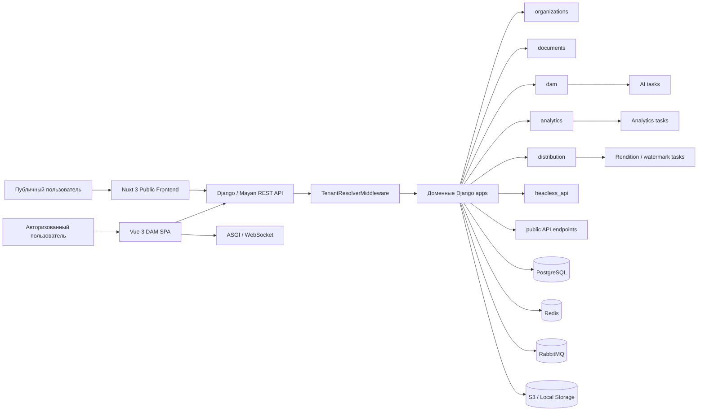
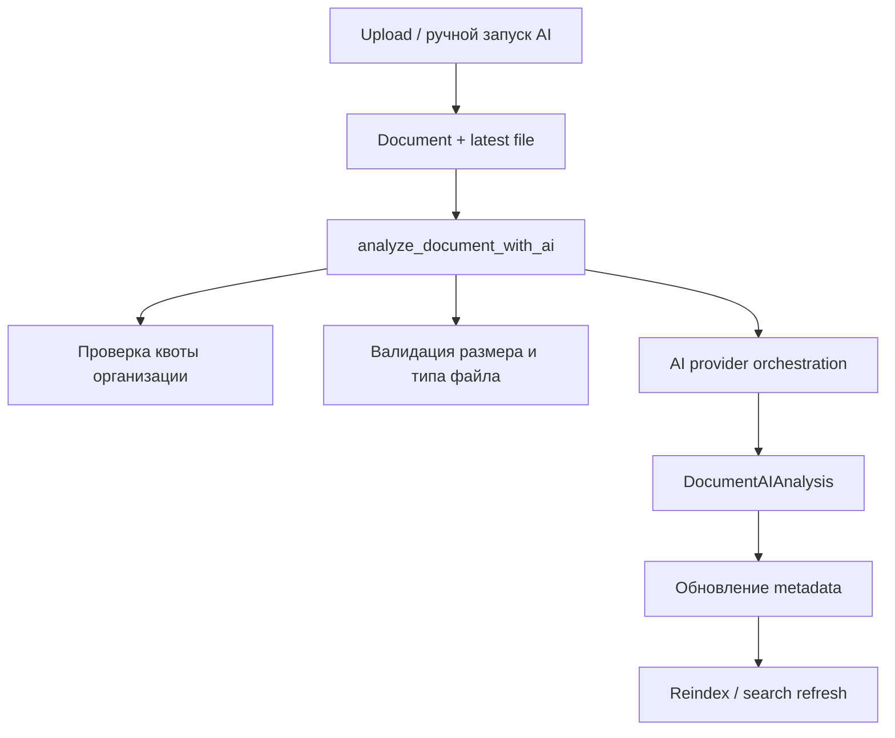
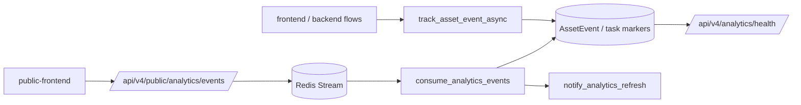
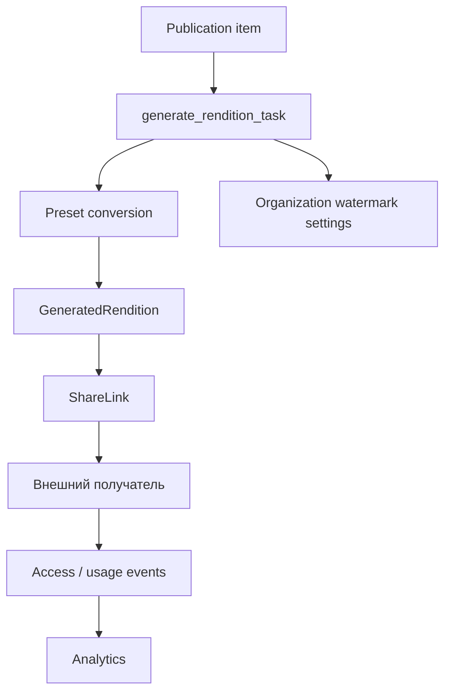
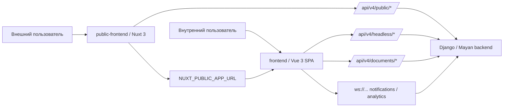
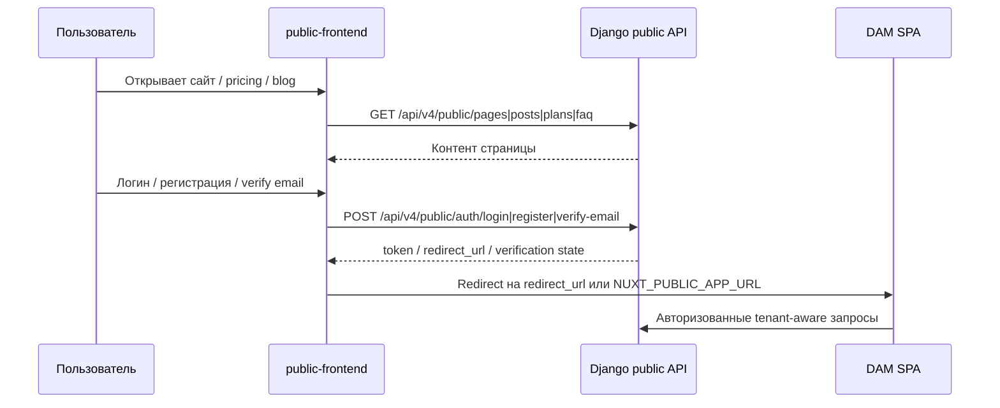

# Карта архитектуры Prime-EDMS

Документ подготовлен на основе актуального индекса `GitNexus` для репозитория `Prime-EDMS` на коммите `add2616` и дополнительной верификации ключевых узлов по исходному коду. В свежем состоянии карты особенно важны четыре усиленных контракта: canonical public API routes, `redirect_url`-handoff между public frontend и основным приложением, `analytics/health` как operational snapshot и явная наблюдаемость runtime patching в `organizations`. Цель документа — зафиксировать не только состав подсистем, но и их связность: как основной DAM SPA, публичный фронтенд, Django/Mayan backend, асинхронные задачи, аналитика и distribution работают как единая платформа.

## 1. Краткое описание системы

`Prime-EDMS` — это tenant-aware DAM-платформа на базе `Mayan EDMS`, расширенная кастомными Django apps и двумя отдельными frontend-контурами:

- `frontend/` — основной авторизованный DAM SPA для работы с активами, аналитикой, коллекциями и distribution-сценариями.
- `public-frontend/` — публичный Nuxt 3 SSR/SSG-контур для маркетинговых страниц, блога, лидогенерации, публичной аутентификации и маршрутизации пользователя в основной продукт.
- `mayan/apps/*` — backend-домен, который реализует multi-tenancy, DAM, analytics, distribution, headless API, публичные API и WebSocket-контракты.

Системный инвариант проекта: tenant-контекст определяется на входе запроса и затем протаскивается в ORM, API, аналитику и асинхронные задачи через `Organization`, `TenantResolverMiddleware` и `TenantAwareMixin`.

## 2. Высокоуровневый ландшафт

## 3. Основные архитектурные контуры

### 3.1 Backend: Django-монолит с модульными приложениями

Backend следует модели modular monolith:

- core Mayan-модули обеспечивают документы, ACL, workflow, OCR, metadata и базовый REST API;
- кастомные apps добавляют бизнес-функции DAM-платформы;
- все подсистемы деплоятся вместе, но логически изолированы по app boundaries.

Ключевые кастомные apps:

- `mayan/apps/organizations` — multi-tenancy, квоты, membership, tenant resolution.
- `mayan/apps/dam` — AI-анализ, AI-метаданные, orchestration AI-провайдеров.
- `mayan/apps/analytics` — события использования, дашборды, отчёты, public/product analytics.
- `mayan/apps/distribution` — публикации, рендишены, share links, watermarking.
- `mayan/apps/headless_api` — SPA-ориентированные endpoints для DAM UI.
- `mayan/apps/rest_api` и public endpoints — общий API-контур для внутреннего и публичного frontend.

### 3.2 Основной frontend: `frontend/`

`frontend/` — это основной продуктовый интерфейс DAM. Он работает как авторизованный SPA и является главной рабочей поверхностью для:

- галереи активов;
- поиска, фильтрации и сохранённых поисков;
- metadata/AI enrichment;
- collections/cabinets;
- analytics dashboards;
- distribution и sharing;
- realtime-уведомлений.

Фактический центр этого контура — `GalleryView` на маршруте `/dam`, который агрегирует поиск, bulk actions, сохранённые поиски, превью, метаданные, контекстное меню и переключение между обычной и виртуализированной сеткой.

### 3.3 Публичный frontend: `public-frontend/`

`public-frontend/` — это не отдельный продукт вне системы, а внешний входной контур платформы:

- маркетинговые страницы;
- pricing, FAQ, blog, contact;
- сбор лидов и newsletter;
- регистрация и логин;
- верификация email;
- публичная аналитика;
- перевод пользователя в основной DAM SPA после успешного входа.

Архитектурно `public-frontend` связан сразу с двумя системами:

- с Django backend через `/api/v4/public/*`;
- с основным приложением через `NUXT_PUBLIC_APP_URL`, на который пользователь перенаправляется после логина.

## 4. Multi-tenancy как системообразующий слой

Tenant isolation — это не локальная деталь одного модуля, а общий контракт платформы.

### 4.1 Разрешение tenant-контекста

`TenantResolverMiddleware` определяет текущую `Organization` для каждого запроса. Основной порядок резолвинга:

1. кастомный домен;
2. поддомен;
3. `X-Organization-Id` для SPA;
4. пользователь/токен;
5. default organization для standalone-режима.

Это означает, что tenant-контекст задаётся до попадания в view и до ORM-фильтрации.

### 4.2 Tenant-aware модели

Через `TenantAwareMixin` tenant-привязку получают:

- `DocumentAIAnalysis`;
- `AssetEvent`;
- `SearchSession`;
- `FeatureUsage`;
- `AnalyticsReportTask`;
- `ShareLink`;
- `DistributionCampaign`;
- и другие tenant-scoped сущности.

Следствие: domain apps работают не как глобальные модули над всей БД, а как доменные сервисы внутри конкретной организации.

### 4.3 Runtime patching как часть tenant-контракта

Multi-tenancy в Prime-EDMS опирается не только на статические модели, но и на runtime patching:

- `patch_HttpRequest()` переопределяет `_current_scheme_host`, чтобы tenant-aware URL generation опирался на organization-level installation URL;
- `patch_organization_fields()` динамически добавляет `organization` в core-модели вроде `Document`, `Tag`, `Cabinet`;
- `patch_document_managers()` заменяет `Document.objects`, `Document.trash`, `Document.valid` на tenant-aware hybrid managers.

Свежее изменение делает этот слой менее "магическим": `organizations/patches.py` теперь ведёт `get_runtime_patch_status()`, а `OrganizationsApp.ready()` логирует агрегированный статус после применения patch sequence. Архитектурно это означает, что runtime patching становится не просто скрытым bootstrap-механизмом, а наблюдаемым operational contract.

### 4.4 Что это даёт архитектурно

- единая shared-schema база с логической изоляцией по `organization`;
- переиспользуемый security-паттерн для API, ORM и Celery;
- возможность SaaS и standalone deployment без разных кодовых веток;
- предсказуемый контракт для фронтендов: запросы либо явно несут tenant context, либо tenant определяется из auth/session.

## 5. DAM-контур

`mayan/apps/dam` расширяет документную модель AI-обогащением и автоматизацией обработки активов.

Главные обязанности:

- хранение AI-результатов в `DocumentAIAnalysis`;
- запуск анализа по загрузке или по запросу пользователя;
- оркестрация AI provider pipeline;
- обновление document metadata;
- повторная индексация и переобогащение поискового слоя.

Пайплайн AI-анализа:

Ключевая особенность этого контура: он уже tenant-aware и учитывает квоты организации, а не просто выполняет абстрактный AI-анализ файла.

## 6. Analytics-контур

`mayan/apps/analytics` — это контур продуктовой и operational наблюдаемости.

### 6.1 Базовый уровень: сырые события

Модель `AssetEvent` хранит tenant-aware события использования активов:

- просмотр;
- скачивание;
- share;
- collection share;
- upload;
- deliver;
- email click.

События индексируются по `organization`, типу события и времени, что позволяет строить tenant-scoped метрики без дополнительных join-слоёв.

### 6.2 Производные функции analytics

На основе `AssetEvent` и связанных сущностей строятся:

- asset dashboards;
- campaign performance;
- search analytics;
- content intelligence;
- bandwidth/cost tracking;
- adoption metrics;
- public/product analytics events;
- отчёты в JSON.

### 6.3 Analytics как operational observability layer

После последних изменений `analytics` отвечает не только за продуктовые метрики, но и за live operational picture:

- `get_operational_snapshot()` собирает состояние Redis stream, consumer marker, public ingest marker, task success/failure markers, counters и свежесть отчетов;
- `/api/v4/analytics/health/` возвращает не просто `status: ok`, а структурированный `snapshot`, который может показать `degraded` или `unknown`;
- `track_asset_event_async`, consumer Redis stream и public ingest endpoint записывают operational markers/counters в cache, чтобы асинхронные проблемы были видны без прямого захода в worker logs.

Это важный архитектурный сдвиг: analytics становится не только downstream-потребителем событий, но и live control plane для диагностики собственного ingestion/reporting контура.

### 6.4 Event stream и связность ingestion-контура

События теперь проходят через явный ingestion pipeline:

У этого контура два свойства:

- public telemetry и внутренние product events сходятся в один analytics domain, а не живут как отдельные disconnected системы;
- operational snapshot проверяет не только финальные таблицы, но и промежуточные stream/task seams.

### 6.5 Аналитика как связующий слой

`analytics` связывает почти все остальные подсистемы:

- DAM генерирует usage и AI-related telemetry;
- distribution создаёт access/download/share signals;
- frontend dashboards читают tenant-scoped отчёты;
- public frontend отправляет engagement events в `/api/v4/public/analytics/events/`.

Таким образом, `analytics` — это не isolated dashboard module, а cross-cutting observability layer.

## 7. Distribution-контур

`mayan/apps/distribution` отвечает за controlled delivery контента вовне.

Основные сущности:

- `Publication`;
- `GeneratedRendition`;
- `RenditionPreset`;
- `ShareLink`;
- `DistributionCampaign`;
- recipient lists и access logs.

### 7.1 Основная функция

Distribution превращает внутренний документный актив в управляемую внешнюю форму потребления:

- создаёт renditions в нужном формате;
- накладывает watermark по настройкам организации;
- выдаёт защищённые ссылки;
- ограничивает просмотры, скачивания, срок жизни;
- передаёт usage signals в analytics.

### 7.2 Генерация рендишенов

Здесь важен tenant-aware watermark contract: настройки watermark зависят от организации публикации, а не от глобальной конфигурации системы.

## 8. Основной DAM SPA и его связность

`frontend/` работает как application shell для внутренних пользователей.

### 8.1 Главные точки связности SPA

- `GalleryView` — ядро DAM UI;
- `ImmersiveGrid` — виртуализация больших наборов активов;
- `assetStore` / `distributionStore` / `favoritesStore` — доменные state slices;
- `useDamSearchFilters` — синхронизация UI-фильтров и URL;
- `useWebSocket` — realtime notifications с `token` и `organization_id`.

### 8.2 Что связывает SPA с backend

- `headless_api` и `documents optimized API`;
- tenant-aware favorites, recent views, saved searches;
- AI endpoints для enrichment;
- analytics dashboards и report generation;
- distribution endpoints;
- WebSocket-уведомления через отдельный ASGI-контур.

### 8.3 Архитектурный смысл

`frontend/` — это operational UI над внутренними доменными моделями. В отличие от `public-frontend`, этот контур работает глубоко в авторизованной и tenant-aware предметной области.

## 9. Публичный Nuxt-контур и его связность

Вот почему `public-frontend` должен входить в полную карту архитектуры.

### 9.1 Что делает `public-frontend`

Nuxt-контур реализует:

- SSR/SSG маркетинговые страницы;
- pricing и FAQ;
- блог;
- forms для контактных заявок;
- newsletter;
- регистрацию;
- логин;
- verify-email;
- public analytics;
- SEO, sitemap, i18n, prerendering.

### 9.2 Как он связан с backend

Он использует публичные endpoints:

- `/api/v4/public/pages`
- `/api/v4/public/posts`
- `/api/v4/public/plans`
- `/api/v4/public/faq`
- `/api/v4/public/leads`
- `/api/v4/public/newsletter`
- `/api/v4/public/legal/consent/`
- `/api/v4/public/auth/register`
- `/api/v4/public/auth/login`
- `/api/v4/public/auth/verify-email`
- `/api/v4/public/analytics/events/`

Ключевое уточнение по текущему состоянию: canonical public routes теперь централизованы в `marketing_cms`, публикуются через `rest_api/urls.py` и используются синхронно в backend, `public-frontend`, MSW mocks и Playwright smoke.

В `useApi()` серверная SSR-часть ходит напрямую в backend, а клиентская работает через Nitro proxy, что даёт единый API-контракт без лишнего CORS-шума.

Отдельный архитектурный контракт для auth-handoff:

- `PublicLoginView` возвращает `redirect_url`, а не заставляет Nuxt жёстко знать destination;
- `PublicVerifyEmailView` тоже возвращает `redirect_url`, замыкая verify flow в backend contract;
- `LoginForm.vue` теперь редиректит в `loginResponse.redirect_url || NUXT_PUBLIC_APP_URL`, то есть handoff управляется и runtime-config, и backend response.

### 9.3 Как он связан с основным приложением

`public-frontend` знает про `NUXT_PUBLIC_APP_URL`. После успешного логина пользователь перенаправляется в основное DAM-приложение. Это делает публичный сайт входной воронкой продукта, а не отдельным detached website.

### 9.4 Диаграмма связности frontend-контуров

### 9.5 Почему он выпадает из локального анализа, если не добить вручную

GitNexus хорошо показывает backend-узлы и конкретные символы, но `public-frontend` выражает связность в основном через:

- endpoint contracts;
- runtime config (`NUXT_PUBLIC_API_URL`, `NUXT_PUBLIC_APP_URL`);
- composables и services;
- SSR/Nitro proxy;
- redirect flows.

Это менее "символьная" связность, чем у Python-классов и Celery tasks, поэтому её важно дополнительно фиксировать чтением конфигов и сервисов.

## 10. Интеграционный поток: public → auth → app

## 11. WebSocket и split-runtime topology

Система использует split topology:

- `:8080` — Django/Gunicorn REST API;
- `:8001` — Daphne/ASGI для realtime;
- `:5173` — DAM SPA;
- `:3000` — public frontend.

Это важно по двум причинам:

- основной SPA зависит и от HTTP API, и от WebSocket;
- public frontend зависит от HTTP/public API и затем ведёт пользователя в DAM SPA.

Именно поэтому frontend-контуры нельзя рассматривать как плоские UI-слои: они входят в разные runtime seams одной платформы.

После последних изменений у этой topology появился отдельный live verification harness: management command `runtime_contract_smoke` проверяет из runtime-контейнера ключевые HTTP seams:

- `analytics_health`;
- `geography_ok`;
- `geography_requires_org`;
- `distribution_campaigns_ok`;
- `distribution_share_links_ok`.

Это важно архитектурно, потому что проверяется уже не только код view, но и реальная опубликованность route, tenant requirements и доступность runtime-стыков.

## 12. Главные зависимости между подсистемами

### Обязательные системные зависимости

- `organizations` → задаёт tenant-aware контракт для backend, analytics, distribution и DAM.
- `documents` → центральная сущность актива, вокруг которой строятся AI, analytics и distribution.
- `dam` → enriches documents и отдаёт результаты в metadata/search/UI.
- `analytics` → наблюдает usage всех ключевых контуров, включая public frontend.
- `distribution` → превращает внутренние активы в управляемые внешние delivery-сценарии.
- `headless_api` → BFF-слой для DAM SPA.
- `public API` → BFF/API-контракт для Nuxt-портала.

### Связность фронтендов

- `frontend` связан с `headless_api`, `documents API`, `analytics`, `distribution`, `WebSocket`.
- `public-frontend` связан с `public API`, `analytics events`, auth flows и `frontend` через redirect в основное приложение.

## 13. Выводы

### Что важно зафиксировать

- В проекте не один frontend, а два разных frontend-контура с разными задачами и разным типом связности.
- `frontend/` — operational/product UI.
- `public-frontend/` — acquisition, SEO, leadgen и auth-entry контур.
- Оба фронтенда завязаны на один backend, но используют разные API-поверхности.
- Архитектурный центр системы — tenant-aware backend вокруг `Organization`, `documents`, `DAM`, `analytics` и `distribution`.

### Как правильно думать о платформе

Корректная модель Prime-EDMS — это не "Django + один SPA", а:

1. tenant-aware backend-платформа;
2. внутренний DAM SPA для работы с активами;
3. внешний Nuxt-портал для публичного контента и воронки входа;
4. общий асинхронный и аналитический слой, связывающий оба frontend-контура с backend-доменом.

### Практический архитектурный тезис

Если меняется:

- tenant contract — это затрагивает backend, DAM SPA и часть auth/public сценариев;
- public API — это затрагивает Nuxt-портал и acquisition funnel;
- documents / DAM / distribution — это бьёт по внутреннему продукту и downstream analytics;
- routing или app URLs — это затрагивает handoff между public frontend и основным приложением.

Поэтому `public-frontend` должен считаться полноправной частью архитектуры платформы, а не второстепенным приложением вне основной системы.

## 14. Риски и слабые места архитектуры

Ниже перечислены не абстрактные "технические долги вообще", а те зоны, где текущая архитектура уже показывает хрупкость или требует повышенного внимания при развитии системы.

### 14.1 Multi-tenancy: сильный фундамент, но высокая цена ошибки

Tenant-aware архитектура — одно из главных преимуществ Prime-EDMS, но именно она создаёт и один из самых дорогих классов рисков.

- Слишком много бизнес-критичных сценариев завязано на корректность `TenantResolverMiddleware`, `request.organization` и `ContextVar`.
- Ошибка в tenant resolution затрагивает сразу API, ORM, аналитику, distribution и WebSocket.
- Часть legacy-слоя в `headless_api` уже отмечена как требующая отдельной ревизии на tenant-safety, значит архитектура пока неоднородна.
- Часть core-моделей получает tenant-поле через runtime patching и `contribute_to_class()`, а не только через статически очевидные model definitions, что усложняет отладку и повышает риск скрытых ORM-расхождений.

Главный архитектурный риск здесь — не локальный баг, а возможность тихого нарушения data isolation.

### 14.2 Route exposure и расхождение между view и реально доступным API

В проекте уже зафиксирован отдельный паттерн риска: наличие view или даже app-level `urls.py` не гарантирует, что endpoint реально опубликован через live `rest_api` router.

- SPA и frontend-код могут быть "правильными" на уровне вызовов, но всё равно падать из-за недомонтированного backend route.
- Такие ошибки плохо читаются снаружи и часто маскируются под "BFF не отвечает" или "данные не загружаются".
- Это особенно опасно для headless endpoints, где frontend и backend эволюционируют быстро и независимо.

Свежие изменения частично снижают этот риск: public auth/public analytics routes централизованы в `marketing_cms` и публикуются через единый `rest_api` router, а `runtime_contract_smoke` формализует часть live route verification. Но сам класс риска никуда не исчезает: контракт маршрутов всё ещё зависит не только от view-кода, но и от дисциплины публикации маршрутов и регулярных smoke-проверок.

### 14.3 Split runtime topology создаёт интеграционную хрупкость

Система работает сразу через четыре разных точки входа:

- `:3000` — `public-frontend`;
- `:5173` — основной DAM SPA;
- `:8080` — Django/Gunicorn API;
- `:8001` — Daphne/WebSocket.

Это даёт гибкость, но также создаёт интеграционную хрупкость:

- ошибки чаще появляются на стыках между сервисами, а не внутри отдельного модуля;
- runtime config вроде `NUXT_PUBLIC_APP_URL`, `NUXT_PUBLIC_API_URL`, `VITE_API_URL`, `VITE_WS_URL` становится частью архитектурного контракта;
- редиректы между public frontend и DAM SPA могут ломаться даже без изменений в доменной логике;
- WebSocket может быть "логически рабочим", но недоступным из-за неправильной endpoint-конфигурации или несогласованности портов.

Это делает систему чувствительной к deployment drift и environment mismatch.

### 14.4 Асинхронный контур: eventual consistency и трудная диагностика

AI-анализ, рендишены, watermarking, часть analytics и уведомления завязаны на Celery и брокерную инфраструктуру.

- Ошибка в очереди или worker не всегда проявляется сразу в UI.
- Пользовательский сценарий может выглядеть "успешно запущенным", но фактически зависнуть на фоне.
- Состояние системы становится распределённым между Django, Redis, RabbitMQ, Celery workers и хранилищем файлов.
- Часть ошибок проявляется позже как неконсистентность данных: нет AI-результата, не сгенерирован rendition, не дошло уведомление, не записалось событие.

Сейчас эта зона стала лучше наблюдаемой: `analytics/health` отдает snapshot, а задачи и consumer пишут operational markers/counters. Но слабое место архитектуры остаётся прежним: даже при улучшенной наблюдаемости без хорошего task monitoring и регулярных operational smoke значительная часть проблем всё ещё остаётся "полускрытой".

### 14.5 Analytics завязана на корректность событий, а не только на код дашбордов

Сильная сторона системы в том, что analytics встроена глубоко в продукт. Слабая сторона — качество аналитики зависит от длинной цепочки предпосылок:

- корректный tenant context;
- корректный вызов tracking middleware или task;
- правильная запись `AssetEvent`;
- согласованность event taxonomy;
- корректные downstream aggregation/report paths.

Риск здесь в том, что интерфейс аналитики может выглядеть рабочим, а фактическая полнота данных уже нарушена.

- Потери событий не всегда видны сразу.
- Ошибки в event creation часто не равны явной ошибке endpoint.
- Product decisions могут начинать опираться на частично неполную или искажённую telemetry.

Для такой архитектуры analytics — это зона не только функционального, но и data integrity риска.

### 14.6 Public frontend зависит от API drift и auth handoff

`public-frontend` архитектурно силён тем, что встроен в платформу, но именно это делает его уязвимым:

- он зависит от стабильности `/api/v4/public/*`;
- использует runtime-configured переход в основное приложение;
- сочетает SSR, proxy, публичные формы, auth и analytics;
- часть связности выражена конфигом и HTTP-контрактами, а не плотными type-safe shared abstractions.

Основные риски:

- backend может изменить публичный API без немедленного явного падения всех страниц;
- auth flow может деградировать на стыке public site → backend → app;
- SEO/SSR-контур может стать "частично живым": контент рендерится, но формы, login или analytics работают нестабильно;
- public frontend проще недооценить при ревью, потому что он выглядит как отдельный сайт, хотя фактически является частью product funnel.

Риск здесь тоже частично смягчён: canonical routes выровнены, `redirect_url` стал явной частью backend contract, а Playwright smoke и mocks зафиксировали ожидаемые ответы. Но эта зона всё ещё опирается на конфиг, HTTP shape и runtime-согласованность, а не на единый shared typed contract.

### 14.7 Тестовый контур пока слабее архитектурной сложности

Архитектура системы уже довольно сложная: multi-tenancy, два frontend-контура, split runtime, async workers, публичный API, WebSocket, analytics, distribution.

При этом подтверждённые ограничения тестового контура остаются существенными:

- полный backend test environment хрупок;
- параллельные test runs конфликтуют за `test_mayan`;
- часть live smoke ещё не зафиксирована отдельным стабильным прогоном;
- Windows shell и container runtime дают разный operational опыт;
- для некоторых сценариев приходится полагаться на targeted suites вместо полного end-to-end покрытия.

Это не значит, что архитектура плохая. Это значит, что текущая verification capacity отстаёт от системной сложности.

### 14.8 Legacy и transition zones

В проекте уже есть переходные зоны:

- legacy analytics/activity endpoints;
- старые DAM/collection маршруты;
- эволюция campaigns к first-class tenant model;
- частичный cleanup старых API contracts после изменения frontend маршрутов.

Архитектурно такие зоны опасны тем, что:

- в системе одновременно существуют old path и new path;
- команда может считать задачу "завершённой", когда новый контур работает, но старый ещё не выведен;
- regressions чаще возникают на совместном существовании двух контрактов, а не в чисто новой реализации.

Это типичная зона для скрытых поддерживающих издержек и несогласованного поведения.

### 14.9 Security и compliance: сильная модель, но не все контуры одинаково укреплены

В проекте уже есть правильные security foundations: RBAC, ACL, tenant isolation, audit logging, watermarking, public share restrictions.

Но слабые места тоже очевидны:

- public share model зависит от password/expiry/download caps и пока не описана как fully hardened против brute-force и edge abuse;
- внешние интеграции и AI-провайдеры увеличивают поверхность отказов и требования к secret management;
- compliance-сценарии требуют не просто правильной модели данных, а устойчивости всей цепочки обработки, логирования и удаления;
- public API и public frontend по определению расширяют внешний attack surface относительно закрытого DAM SPA.

Это означает, что security posture системы не может оцениваться только по внутреннему backend-коду — нужно смотреть на весь product perimeter.

## 15. Приоритетные зоны усиления

Если переводить архитектурные риски в практический порядок усиления, я бы выделил следующие направления.

### 15.1 Наивысший приоритет

- Закрыть оставшиеся live smoke gaps для tenant-scoped HTTP и WebSocket-сценариев.
- Довести до конца ревизию legacy tenant-unsafe или transition endpoints.
- Зафиксировать обязательную проверку route exposure для всех новых headless/public endpoints.

### 15.2 Средний приоритет

- Усилить operational monitoring по Celery/Redis/RabbitMQ и критическим async pipeline.
- Сделать проверку public frontend auth handoff и public API drift отдельным обязательным smoke-контуром.
- Укрепить end-to-end telemetry validation для analytics, а не только UI-слой отчётов.

### 15.3 Стратегический приоритет

- Сократить runtime magic вокруг core model patching там, где это возможно без разрушения совместимости.
- Уменьшить разрыв между системной сложностью и возможностями полного regression verification.
- Продолжить cleanup старых маршрутов и слоёв, чтобы уменьшить число параллельных архитектурных контрактов в одной системе.
